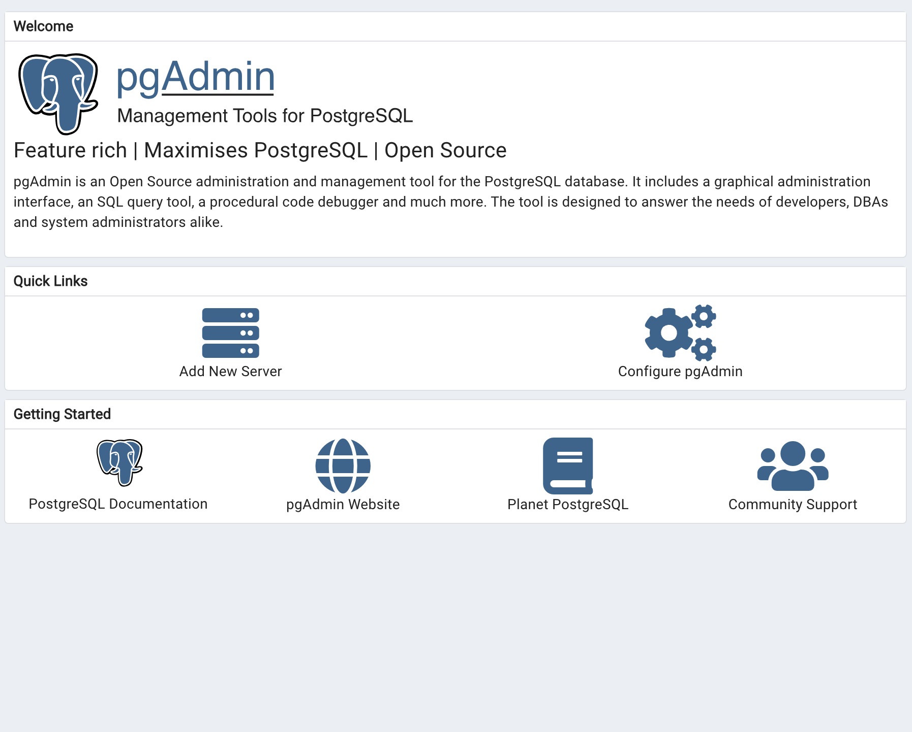
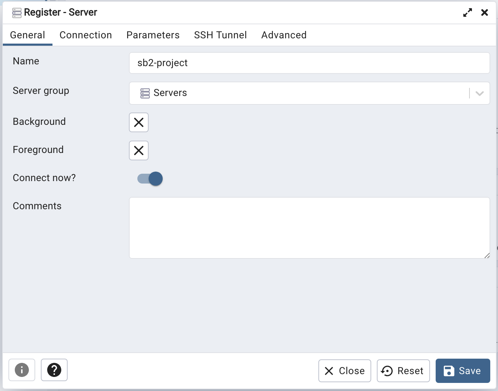

# Contributing

This file contains all setup steps required for local development of this codebase.

## Contents

- [PostgreSQL](#postgresql)
    - [Installation](#installation)
    - [Setup](#setup)
    - [pgAdmin](#pgadmin)

## PostgreSQL 

### Installation

All team members use MacOS, so it's possible to install with homebrew:

```bash
brew install postgresql@15
```

Be sure to addd the psql command line tool to your path, e.g.:

```bash
echo 'export PATH="/opt/homebrew/opt/postgresql@15/bin:$PATH"' >> ~/.zshrc
```

Either reload your terminal or source your config file after this step:

```bash
source ~/.zshrc
```

Finally, run `psql --version` to ensure that everything is installed correctly.

### Setup

You'll need to create a database for local development. Its name should match the configuration in `config/default.toml`:

```bash
createdb sb2-project
```

After this, try running the server (`npm start`). This should create some tables in the database if everything is configured correctly. 
To verify this, connect to the database via the `psql` command line tool:

```bash
psql sb2-project
```

Then, run `\dt` to list the tables. The output should look something like this (note the users table):

```bash
          List of relations
 Schema | Name  | Type  |   Owner
--------+-------+-------+------------
 public | users | table | herbierand
(1 row)
```

### pgAdmin

Optionally, you may choose to install the pgAdmin GUI tool for database inspection and development:
- [Download for MacOS](https://www.pgadmin.org/download/pgadmin-4-macos/)
- [Download for Different Platforms](https://www.pgadmin.org/download/)

First, open the pgAdmin and click `Add New Server`.



In the `General` tab, type `sb2-project` for Name.



In the `Connection` tab,
- Host name/address: `localhost`
- Port: `5432` 
- Username: the name of the Superuser


Then, click `Save` and the connection should be established.